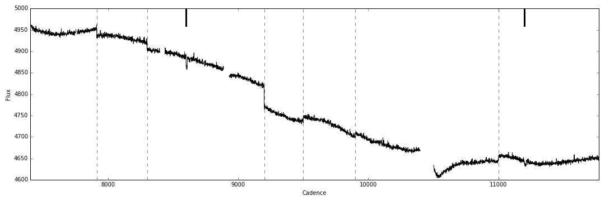

Kepler Jump Detection and Classification
========================================

`KeplerJC` (Kepler Jump Correction) is a Python package to detect, classify, and remove isolated
discontinuities from individual Kepler light curves.

The code models the Kepler light curve as a Gaussian Process, scans the light curve for discontinuities, and classifies the discontinuities using simple BIC-based model selection between a jump, transit, and flare.

Installation
------------
Clone the code from GitHub

    git clone https://github.com/hpparvi/KeplerJC.git

and install

    cd KeplerJC
    python setup.py install [--user]

Jump detection and correction
-----------------------------
    from keplerjc import KData, JumpFinder, JumpClassifier

    kdata = KData(cadence, flux, quality)

    jf = JumpFinder(kdata)
    jumps = jf.find_jumps()

    jc = JumpClassifier(kdata, jf.hp)
    jc.classify(jumps)

    kdata.plot(jumps)

The figure above is reproduced in the `Example_1` IPython notebook under the `examples` directory. Discontinuities identified as jumps are marked with slashed vertical lines, while transit-like features are marked as thick vertical lines spanning the upper part of the figure.

Authors
-------

- Hannu Parviainen
- Suzanne Aigrain
